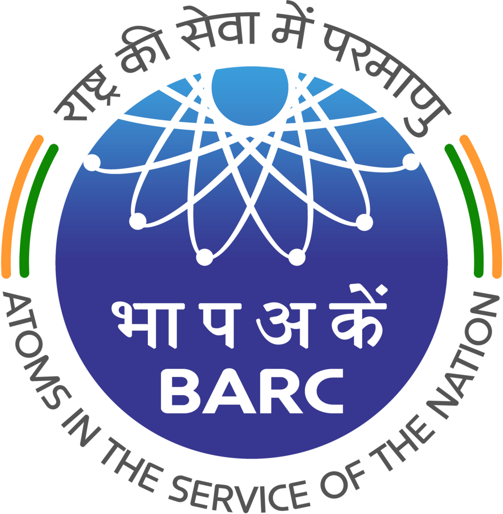
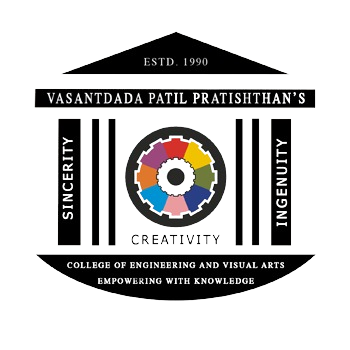

<div align="center">
  <br />
    
  <br />

  <div>
    
    
    
    
  </div>

  <h3 align="center">My Personal Portfolio Website</h3>

   <div align="center">
      Hi! I'm Aryan, a Developer based in Mumbai.
    </div>
    
   <div align="center">
     <h3><a href="https://portfolio-aryan-gaikwad.vercel.app/">Live Demo</a></h3>
   </div>
</div>

## 📋 <a name="table">Table of Contents</a>

1. 🤖 [Introduction](#introduction)
2. ⚙️ [Tech Stack](#tech-stack)
3. 🔋 [Features](#features)
4. 🤸 [Quick Start](#quick-start)
5. 📧 [EmailJS Setup](#emailjs-setup)

## <a name="introduction">🤖 Introduction</a>

Welcome to my personal portfolio website! I'm **Aryan Gaikwad**, a **Full Stack Engineer & Applied AI Developer** based in Mumbai, India. 

This portfolio showcases my expertise in **designing and deploying scalable full stack and network intelligence systems**. As an Ex-Intern at BHABHA ATOMIC RESEARCH CENTRE (BARC), I specialize in building production-grade applications with clean architecture and scalable backends.

Built with modern technologies like Next.js, Three.js, and Framer Motion, this portfolio features interactive 3D elements, smooth animations, and a responsive design that works seamlessly across all devices.

## <a name="tech-stack">⚙️ Tech Stack</a>

- **Frontend**: Next.js, React, TypeScript, Tailwind CSS
- **Backend**: Node.js, Python
- **Database & Services**: Firebase
- **3D & Animation**: Three.js, Framer Motion
- **Tools & Libraries**: Axios, EmailJS, Sentry

## <a name="features">🔋 Features</a>

👉 **Hero Section**: Captivating introduction with spotlight effects, dynamic background, and modern off-white theme. Features the title "Full Stack Engineer & Applied AI Developer" with mustard yellow accent colors.

👉 **Bento Grid**: Modern layout showcasing skills, tech stack, and personal information using cutting-edge CSS design with responsive grid system.

👉 **3D Elements**: Interactive 3D design elements including GitHub-style globe, card hover effects, and dynamic canvas-based visualizations.

👉 **Work Experience**: Professional background displayed with elegant light gray gradient boxes featuring:
- Project Trainee at BARC (Unsupervised network anomaly detection)
- Student Coordinator at Training & Placement Office

👉 **VS Code Extensions**: Dedicated showcase section for published extensions:
- CAPTCHA OCR Cropper - A feature-rich extension for image processing and OCR with preprocessing capabilities

👉 **Featured Projects**: Interactive project showcase including:
- NutriLens - AI-Powered Nutrition Assistant (Claude AI integration)
- GateLog - Visitor Management System (Full-stack with role-based access)

👉 **Color Theme**: Modern design with:
- Primary Blue: #374097 (Chambray) for accent highlights
- Secondary Mustard Yellow: #E8B923 for call-to-action elements
- Off-white background (#FAFAFA) for clean, modern aesthetics

👉 **Contact Form**: Integrated EmailJS contact form for direct communication with instant notifications.

👉 **Responsiveness**: Seamless adaptability across all devices with mobile-first design approach.

## <a name="quick-start">🤸 Quick Start</a>

Follow these steps to set up the project locally on your machine.

**Prerequisites**

Make sure you have the following installed on your machine:

- [Git](https://git-scm.com/)
- [Node.js](https://nodejs.org/en)
- [npm](https://www.npmjs.com/) (Node Package Manager)

**Cloning the Repository**

```bash
git clone <repository-url>
cd portfolio
```

**Installation**

Install the project dependencies using npm:

```bash
npm install
```

**Running the Project**

```bash
npm run dev
```

Open [http://localhost:3000](http://localhost:3000) in your browser to view the project.

## 💼 <a name="experience">Work Experience</a>

### Project Trainee - Bhabha Atomic Research Centre (BARC)

<div align="center">
  
</div>

Developed an unsupervised network anomaly detection system using an ensemble of autoencoders to model normal traffic and flag anomalies via reconstruction error. Worked with Scientific Officers in a high security research environment and validated detection on large scale IoT traffic exceeding 100k flows.

**Key Achievements**:
- Built ML models for network anomaly detection
- Validated on large-scale IoT traffic (100k+ flows)
- Worked in a secure research environment with industry professionals

### Student Coordinator - Training & Placement Office

<div align="center">
  
</div>

Assisted in coordinating campus recruitment drives and student-company interactions. Helped organize workshops and placement-focused events, ensuring smooth execution. Acted as a point of contact to resolve student queries and ensure smooth operations.

## 🚀 <a name="projects">Featured Projects</a>

### NutriLens - AI-Powered Nutrition Assistant
A fully free web app that analyzes food images to deliver real-time nutritional insights using AI. Integrated Claude via OpenRouter API to offer intelligent meal assessments and promote healthier eating habits. Designed for commercial production-grade deployment with clean architecture, modular code, and scalable backend.

**Tech Stack**: Next.js, React, TailwindCSS, Firebase, OpenRouter API

### GateLog – Visitor Management System
Built a full-stack visitor management system for residential and commercial societies to enhance security and accountability. Designed with role-based access control, real-time resident approvals, and PDF export of visitor logs. Architected for commercial production-grade deployment on Vercel.

**Tech Stack**: Next.js, React, TailwindCSS, Firebase

## 🔌 <a name="extensions">VS Code Extensions</a>

### CAPTCHA OCR Cropper
A VS Code extension that opens a webview where you can load or paste an image, drag a crop rectangle, and run OCR on the cropped area using OCR.space. Features instant OCR with preprocessing (upscaling + grayscale threshold) happening locally. Adjust threshold and scale sliders for improved accuracy with automatic re-runs.

[Visit on VS Code Marketplace](https://marketplace.visualstudio.com/items?itemName=AryanGaikwad.captcha-ocr-cropper)

## <a name="emailjs-setup">📧 EmailJS Setup</a>

To enable the contact form functionality:

1. Sign up for an account at [EmailJS](https://www.emailjs.com/)
2. After logging in, go to the "Email Services" tab and create a new service (e.g., Gmail, Outlook, etc.)
3. Go to the "Email Templates" tab and create a new template
4. Find your service ID, template ID, and public key in the EmailJS dashboard:
   - Service ID: Found in the "Email Services" tab, it's the ID of the service you created
   - Template ID: Found in the "Email Templates" tab, it's the ID of the template you created
   - Public Key: Found in the "Account" tab under "API Keys"
5. Create a `.env.local` file in the root directory with the following variables:
   ```
   EMAILJS_SERVICE_ID=your_service_id
   EMAILJS_TEMPLATE_ID=your_template_id
   EMAILJS_PUBLIC_KEY=your_public_key

